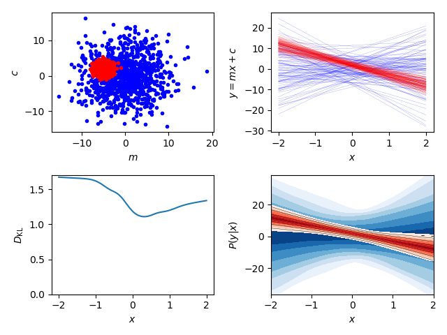

# Summary

Scientists are often concerned with numerical values of parameters in
scientific models. Our knowledge of such things can be quantified and presented
as a probability distribution:

 

Plots like the above can be created using two-dimensional kernel density
estimation using packages such as
[scipy](https://docs.scipy.org/doc/scipy/reference/generated/scipy.stats.gaussian_kde.html),
[getdist](http://getdist.readthedocs.io/en/latest/intro.html) and
[corner](https://corner.readthedocs.io/en/latest/), where the samples provided
as inputs to such programs are typically created by a Markov-Chain-Monte-Carlo
analysis.

As well as uncertain parameters, scientists may also be interested in
quantifying uncertainty in functional relationships. Take as a universally
relatable case the equation of a straight line ``y = m*x + c``. If one measured
the gradient ``m`` and intercept ``c`` with some uncertainty, then our ability
to predict ``y`` from ``x`` using the straight line relationship would also be
uncertain, and plotted thus:

 

The above example is a little over-simplified, but the code has been used in
the latest two Planck inflation papers [-@inflation2015][-@inflation2018] to
quantify our knowledge of the primordial power spectrum of curvature
perturbations, by [@Hee2015] in examining the dark energy equation of state
(and later by [@Hee2016]), by [@Higson2017] for measuring errors in parameter
estimation and by [@Higson2018] for providing diagnostic tests for nested
sampling.                

``fgivenx`` is a python package for functional posterior plotting, currently
used in astronomy, but will be of use to any scientists performing any Bayesian
analysis which have predictive posteriors that are functions. The source code
for ``fgivenx`` is available on
[github](https://github.com/williamjameshandley/fgivenx) and has been archived to
Zenodo with the linked DOI: [@zenodo] 

# Acknowledgements

We acknowledge contributions and bug-testing from Ed Higson

# References
